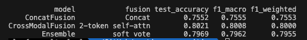
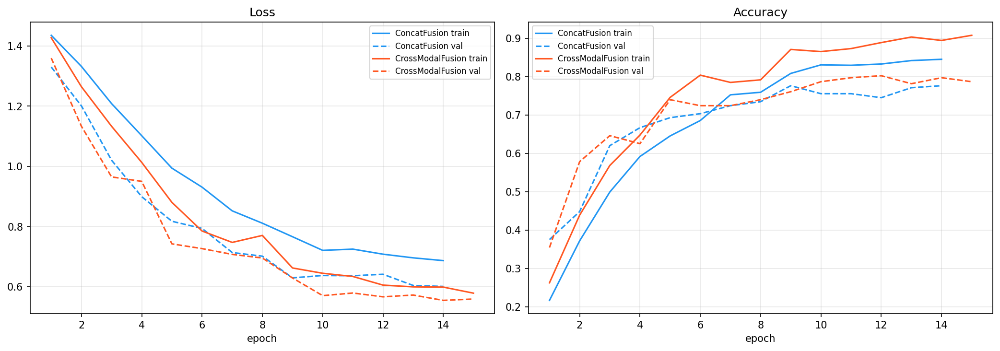
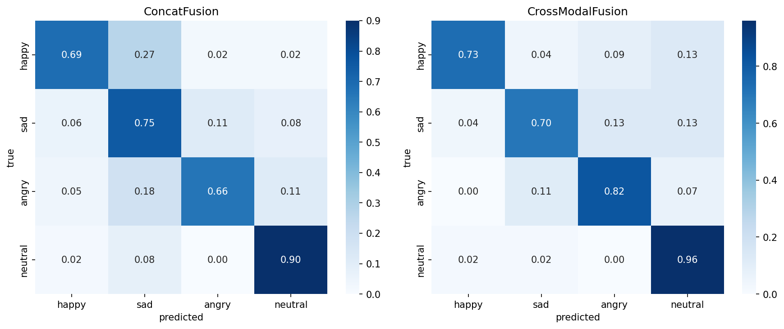

# 멀티모달 감정 분류 (텍스트 + 멜/스펙트로그램)

ERD-MA 계열 데이터를 `dataset/` 형식으로 정리한 뒤, **사전학습 텍스트 인코더(BERT)**와 **이미지 인코더(EfficientNet-B0)**를 결합하여 `happy` / `sad` / `angry` / `neutral` 4클래스를 분류합니다. 두 가지 **fusion** 방식을 학습·비교하고, `outputs/`에 곡선·혼동행렬·지표 표를 저장합니다.

## 실행 요약

```bash
# 1) 원본 ERD-MA → dataset/ (spectrograms/, texts.csv, labels.csv)
python prepare_dataset.py --erd-root "<ERD-MA 경로>" --out dataset --spec-folder mel

# 2) 학습 및 평가 (MixUp 사용 시)
python main.py --mixup
```

산출물:

- `outputs/figures/learning_curves.png` — 에폭별 train/val **loss·accuracy** (두 모델 비교)
- `outputs/figures/confusion_matrix.png` — 테스트셋 **혼동행렬** (행 정규화 비율, 모델별 패널)
- `outputs/figures/ConcatFusion.png` — **ConcatFusion** 테스트 `classification_report` 터미널 캡처
- `outputs/figures/CrossModalFusion.png` — **CrossModalFusion** 테스트 `classification_report` 터미널 캡처
- `outputs/figures/results.png` — 모델별 요약 표·앙상블 출력 터미널 캡처
- `outputs/results.csv` — 위 요약 지표의 CSV

---

## 1. 데이터 분석 및 전처리

### 1.1 원본 구조 정리 (`prepare_dataset.py`)

- **이유:** 과제·학습 파이프라인이 기대하는 형태는 `dataset/spectrograms/` + `texts.csv` + `labels.csv`인데, ERD-MA는 모달·감정별 하위 폴더에 흩어져 있음. **동일 샘플의 텍스트와 스펙트로그램을 `id`로 고정**해 두어야 멀티모달 학습이 가능함.
- **수행:** 감정 클래스 폴더(`happy`, `sad`, `angry`, `neutral`) 아래에서 텍스트 파일과 대응하는 이미지를 짝지어, 고유 `id`(예: `감정__파일 stem`)로 스펙을 복사·저장하고 CSV 두 개를 생성.

### 1.2 로드·정합 (`data.py` — `load_and_merge_dataframe`)

| 단계 | 이유 |
|------|------|
| `texts.csv`와 `labels.csv`를 `id`로 **inner merge** | 텍스트·라벨이 어긋난 행을 제외해 **학습 신호 일관성** 유지 |
| 감정 문자열 **소문자·trim** 및 `EMOTION_CLASSES` 검증 | 라벨 철자·대소문자 불일치로 인한 **조용한 오매핑** 방지 |
| (선택) 아랍어 구간 **영어 번역** (`TRANSLATE_AR_TO_EN`) | BERT(`bert-base-uncased`)가 **영어**에 맞춰져 있을 때 입력 분포를 맞춤. 스펙트로그램은 여전히 **아랍어 발화** 기반이므로 보고서에서 **모달 간 언어 정합**을 언급할 것 |
| 스펙 파일 **존재 여부**·텍스트 **비어 있지 않음** 필터 | 결측 모달은 배치·손실 정의가 모호해지고 **학습 불안정** 유발 |

### 1.3 데이터 분할

- **Stratified train / val / test (70% / 15% / 15%)**  
  - **이유:** 클래스 비율을 각 분할에서 최대한 유지해 **검증·테스트 지표가 전체 분포를 대표**하도록 함.

### 1.4 텍스트 전처리 (Dataset 내부)

- **BERT tokenizer:** `max_length=128`, `padding=max_length`, `truncation=True`  
  - **이유:** 서브워드 사전·배치 텐서 형태를 사전학습과 맞추고, 긴 문장은 **메모리·시간 한도** 내에서 자름.

### 1.5 이미지 전처리 (`build_transforms`)

| 구분 | 내용 | 이유 |
|------|------|------|
| 학습 | `Resize(224,224)` → `RandomResizedCrop`, `ColorJitter`, `RandomGrayscale`, `GaussianBlur`, `RandomErasing` 등 | 스펙트로그램에 **위치·대비·가림** 변화를 주어 **과적합 완화**; ImageNet 백본 입력 규격(224)에 맞춤 |
| 검증·테스트 | `Resize` + `Normalize`만 | **동일한 평가 조건** 유지(증강으로 점수 부풀리기 방지) |
| `Normalize(ImageNet mean/std)` | 사전학습 **EfficientNet**과 통계 일치 → **수렴·표현력** 유리 |

### 1.6 클래스 불균형

- **`WeightedRandomSampler`:** 배치에서 소수 클래스가 더 자주 뽑히도록 함.  
- **`CrossEntropyLoss(weight=…)`:** 손실에서 클래스 빈도에 따른 편향을 **가중치로 재조정**.  
- **이유:** 불균형이 크면 다수 클래스로 치우친 결정경계와 **낮은 macro-F1**이 나오기 쉬움.

---

## 2. 모델 구조 설명

### 2.1 공통 구성

- **TextEncoder:** `BERT` 마지막 은닉에서 **`[CLS]` 벡터**를 문장 표현으로 사용. 하위 `TEXT_FREEZE_LAYERS`개 레이어는 동결해 **미세조정 비용·과적합**을 줄임.
- **ImageEncoder:** `timm` **EfficientNet-B0**, ImageNet 사전학습, 분류 헤드 제거 후 벡터 추출. 파라미터의 앞쪽 `IMAGE_FREEZE_RATIO` 비율은 동결.

### 2.2 `ConcatFusionModel` vs `CrossModalFusionModel`



| 항목 | ConcatFusionModel | CrossModalFusionModel |
|------|-------------------|------------------------|
| 융합 | 텍스트·이미지 벡터를 **채널 방향 concat** → Linear(…→512) → 분류 헤드 | 텍스트·이미지를 동일 차원(512)으로 **투영**한 뒤 **길이 2 시퀀스**로 쌓고, **Multi-Head Self-Attention** 후 잔차·LayerNorm, **평균 풀링** → 분류 헤드 |
| 특성 | 구현이 단순하고 안정적인 **강한 베이스라인** | 두 모달을 **토큰으로 두고 서로 attention**하여 상호작용을 명시적으로 모델링(단순 concat 대비 **비선형 상호 참조**) |
| 파라미터·연산 | 상대적으로 가벼움 | Attention으로 약간 무거움 |

---

## 3. 실험 결과

테스트셋 크기 **192** 샘플 기준(동일 실행)으로 정리함.

### 3.1 모델별 테스트 요약 (`outputs/results.csv`와 동일)

| 모델 | Fusion | Test Accuracy | F1 Macro | F1 Weighted |
|------|--------|---------------|----------|-------------|
| ConcatFusion | Concat | 0.7552 | 0.7555 | 0.7553 |
| CrossModalFusion | 2-token self-attn | **0.8021** | **0.8008** | **0.8000** |
| Ensemble | soft vote | 0.7969 | 0.7962 | 0.7955 |

### 3.2 ConcatFusion — 클래스별 classification report (테스트)

| | precision | recall | f1-score | support |
|--|-----------|--------|----------|---------|
| happy | 0.8378 | 0.6889 | 0.7561 | 45 |
| sad | 0.6250 | 0.7547 | 0.6838 | 53 |
| angry | 0.8056 | 0.6591 | 0.7250 | 44 |
| neutral | 0.8182 | 0.9000 | 0.8571 | 50 |
| **accuracy** | | | **0.7552** | 192 |
| **macro avg** | 0.7716 | 0.7507 | 0.7555 | 192 |
| **weighted avg** | 0.7666 | 0.7552 | 0.7553 | 192 |

### 3.3 CrossModalFusion — 클래스별 classification report (테스트)

| | precision | recall | f1-score | support |
|--|-----------|--------|----------|---------|
| happy | 0.9167 | 0.7333 | 0.8148 | 45 |
| sad | 0.8222 | 0.6981 | 0.7551 | 53 |
| angry | 0.7660 | 0.8182 | 0.7912 | 44 |
| neutral | 0.7500 | 0.9600 | 0.8421 | 50 |
| **accuracy** | | | **0.8021** | 192 |
| **macro avg** | 0.8137 | 0.8024 | 0.8008 | 192 |
| **weighted avg** | 0.8127 | 0.8021 | 0.8000 | 192 |

### 3.5 학습 곡선



**Loss(왼쪽):** 두 모델 모두 train·val loss가 에폭이 지날수록 하향하며 수렴함. 최종 구간에서 **CrossModalFusion**(주황)의 train loss는 약 **0.58**, val loss는 약 **0.56** 수준이고, **ConcatFusion**(파랑)은 train 약 **0.69**, val 약 **0.60**으로 CrossModal이 손실 면에서 더 유리함. 대략 4에폭 이후부터 CrossModal의 val loss가 Concat 아래에 머무름.

**Accuracy(오른쪽):** CrossModal의 train acc는 약 **91%**, val acc는 약 **79%**까지 상승하고, Concat은 train 약 **84%**, val 약 **78%** 근처에서 마무리됨. 검증 정확도 격차는 train 격차보다 작아, 둘 다 어느 정도 일반화는 되나 **CrossModal이 조금 더 높은 검증 성능**을 보임. 초반 1–3에폭에서 CrossModal val acc의 상승이 더 가파른 편이라, 동일 설정에서 **초기 수렴이 다소 빠른 경향**이 있음.

### 3.6 혼동행렬



행은 실제 클래스, 열은 예측 클래스이며, 셀 값은 **해당 실제 클래스 샘플 중 그렇게 예측된 비율**(행 합이 1에 가깝게 정규화됨).

**ConcatFusion(왼쪽):** 실제 **happy**의 약 **69%**만 happy로 맞추고, **약 27%**를 **sad**로 오분류함(가장 큰 혼동). **sad**는 약 **75%** 정답, angry·neutral으로의 비중은 상대적으로 작음. **angry**는 약 **66%** 정답에 그치고 sad(약 18%)·neutral(약 11%)과 혼동. **neutral**은 약 **90%** 정답으로 네 클래스 중 가장 안정적.

**CrossModalFusion(오른쪽):** **happy** 정답률은 약 **73%**로 소폭 개선되고, happy→sad 오분류는 **약 4%**로 **Concat 대비 크게 감소**(텍스트·이미지 토큰 간 attention이 유사 감정 혼동 완화에 기여한 것으로 해석 가능). **sad**는 약 **70%** 정답으로 Concat(75%)보다 소폭 낮아지고, angry·neutral으로의 분산이 조금 커짐. **angry**는 약 **82%** 정답으로 **Concat(66%) 대비 큰 폭 개선**. **neutral**은 약 **96%** 정답으로 두 모델 중 가장 높음.

**요약:** CrossModal은 특히 **angry 분리**와 **happy–sad 혼동 완화**에서 이점이 크고, neutral은 두 모델 모두 비교적 쉬운 클래스. 이는 §3.3에서 CrossModal의 angry recall·전체 accuracy가 Concat보다 높게 나온 결과와 방향이 일치함.

---

## 4. 성능 개선 전략 및 결과

| 기법 | 코드·설정 위치 | 목적 |
|------|----------------|------|
| **이미지 증강** | `data.py` `build_transforms` | 일반화, 과적합 완화 |
| **Dropout + LayerNorm** | `models.py` 분류 헤드·융합부 | 정규화, 과적합 완화 |
| **AdamW + weight decay** | `train.py` `optimizer_groups` | 가중치 폭주 억제 (`bias`/`LayerNorm`은 decay 제외) |
| **OneCycleLR** | `train.py` `train_model` | 워밍업 후 코사인 형태로 **학습률 스케줄** |
| **가중 CE + WeightedRandomSampler** | `data.py` / `train.py` | **클래스 불균형** 대응 |
| **Early stopping** | `train.py` (val accuracy 기준) | 검증 악화 시 과적합 구간 학습 중단 |
| **MixUp (`--mixup`)** | `train.py` `mixup_batch` | **이미지 픽셀만** 배치 내 보간 + **이중 레이블 손실**로 결정경계 완화(감정 경계가 애매한 샘플에 유리할 수 있음). 텍스트는 그대로이므로 보고서에서 **한계**를 명시 |
| **Label smoothing** | `CrossEntropyLoss(..., label_smoothing=…)` | 과신(over-confidence) 완화, 라벨 노이즈에 다소 강건 |
| **Gradient clipping** | `clip_grad_norm_(..., GRAD_CLIP)` | Transformer/BERT 미세조정 시 **그래디언트 폭주** 완화 |
| **Ensemble** | `train.py` `ensemble_predict` | 두 fusion 모델의 **소프트맥스 평균**으로 분산 감소 시도(본 실행에서는 단일 CrossModal이 소폭 우세) |
| **CUDA AMP (선택)** | `train.py` `autocast` / `GradScaler` | CUDA 사용 시 메모리·속도; Mac CPU 등에서는 비활성 |

### 4.1 전략 적용 후 요약

**CrossModalFusion**이 ConcatFusion 대비 **Accuracy·macro-F1**에서 높고, **Ensemble**은 본 실행에서 CrossModal 단일보다 소폭 낮아 두 모델의 오류가 완전히 상보적이지 않았음을 시사함.

---

## 5. 분석 및 결론

본 실험에서는 동일 데이터·동일 하이퍼파라미터(및 선택적 MixUp) 하에서 **ConcatFusion**과 **CrossModalFusion**을 비교했고, 테스트 192샘플 기준 **CrossModalFusion이 전체 정확도 0.8021·macro-F1 0.8008**으로 Concat(0.7552 / 0.7555)보다 우수했다(§3.1, §3.3). 학습 곡선에서도 CrossModal이 검증 손실·정확도 모두 다소 유리한 궤적을 보였다(§3.5).

**Fusion에 대한 해석:** Concat은 텍스트·이미지 벡터를 이어 붙인 뒤 MLP로만 결합하므로 구조가 단순하고 베이스라인으로 적합하다. 반면 CrossModal은 두 모달을 동일 차원 토큰으로 올려 **self-attention**으로 교차 참조를 한 번 수행하므로, “유사 감정이 텍스트와 스펙에서 어떻게 연결되는지”를 더 유연하게 잡을 여지가 있다. 혼동행렬에서 **Concat이 happy를 sad로 크게 잘못 보던 패턴(약 27%)이 CrossModal에서 약 4% 수준으로 줄어든 점**은, 단순 연결보다 **토큰 간 상호작용**이 감정 경계(특히 happy–sad)에 도움이 된 정황과 맞닿아 있다(§3.6). angry 클래스는 Concat에서 대각 비율이 낮았으나 CrossModal에서 뚜렷이 개선되어, **음향 패턴이 중요한 클래스**에서 attention 융합의 이점이 드러난다고 볼 수 있다.

**앙상블:** 소프트 보팅 앙상블(0.7969)은 CrossModal 단일(0.8021)보다 낮았다. 두 모델의 오류가 **같은 샘플에서 상보적이지 않고** 일부 중복될 때 나타나는 전형적인 현상으로, “모델 수를 늘린다고 항상 향상되지는 않음”을 시사한다.

**MixUp·정규화:** MixUp은 이미지 픽셀만 보간하므로 멀티모달 정의상 완전하지 않다. 그럼에도 스펙트로그램 도메인에서는 국소 가림·혼합이 **과적합 완화**에 기여할 수 있다. Label smoothing·gradient clipping은 BERT·Attention을 미세조정할 때 **과신·그래디언트 폭주**를 완화하는 실무적 선택이다.

**한계 및 향후:** (1) **언어 정합:** 음성·스펙은 아랍어 발화에 가깝고, 텍스트는 아랍어이거나 번역·영어 BERT에 맞춘 경우 **모달 간 의미 공간이 어긋날** 수 있다. 아랍어 특화 LM·다국어 BERT 또는 번역 정책을 바꾸면 결과가 달라질 수 있다. (2) **평가 분산:** 테스트가 약 192건·단일 랜덤 분할이므로, 수치는 **방향성** 참고에 적합하고 엄밀한 비교에는 k-fold나 여러 시드 반복이 바람직하다. (3) **클래스별:** CrossModal에서 sad만 소폭 악화된 점은, 향후 sad 전용 데이터 보강이나 클래스별 임계값 조정 등으로 보완할 수 있다.

**결론:** 동일 파이프라인에서 **2토큰 self-attention 기반 CrossModalFusion**이 Concat 대비 전체·다수 클래스에서 유리했고, 혼동 구조 분석과 일치한다.

---

## 프로젝트 파일 요약

| 파일 | 역할 |
|------|------|
| `prepare_dataset.py` | ERD-MA → `dataset/` 표준 레이아웃 |
| `config.py` | 경로·하이퍼파라미터·클래스 정의 |
| `data.py` | 로드·전처리·Dataset·DataLoader·가중치 |
| `models.py` | 두 fusion 모델 |
| `train.py` | 학습 루프·스케줄러·MixUp·앙상블 |
| `evaluate.py` | 테스트 지표 |
| `plots.py` | 곡선·혼동행렬 저장 |
| `main.py` | 실험 진입점 |